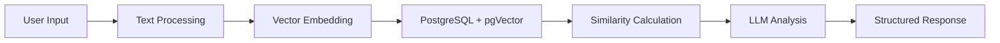

# 📁 API Specification - AI-Powered Career Platform

This document describes the comprehensive API endpoints for the ResMatch backend, featuring advanced AI/ML capabilities for intelligent job matching, skill analysis, and career recommendations. All endpoints are prefixed from the root (no `/api/v1`).

---

## 🔐 Authentication

- All endpoints require JWT authentication except `/auth/register` and `/auth/token`.
- Pass the JWT as a Bearer token in the `Authorization` header.
- **Authentication Method**: OAuth2 with JWT tokens (15-minute expiry with refresh capability)
- **Security**: bcrypt password hashing, SQL injection prevention via SQLAlchemy ORM

---

## 📝 Endpoints

### 💼 Jobs & AI-Powered Search

| Method | Path                 | Description                                                        | Auth | AI Features                                |
| ------ | -------------------- | ------------------------------------------------------------------ | ---- | ------------------------------------------ |
| GET    | `/jobs/search`       | Search jobs from external job boards with AI-powered match scoring | ✅   | Vector embeddings, semantic similarity     |
| POST   | `/jobs/save`         | Save a job manually                                                | ✅   | Auto-generates embeddings                  |
| GET    | `/jobs`              | List saved/matched/applied jobs                                    | ✅   | Filtered by AI match scores                |
| GET    | `/jobs/{id}`         | Get details of a specific job                                      | ✅   | Includes ML-generated insights             |
| PUT    | `/jobs/{id}`         | Update job status or notes                                         | ✅   | -                                          |
| DELETE | `/jobs/{id}`         | Delete a saved job                                                 | ✅   | -                                          |
| GET    | `/jobs/{id}/summary` | Generate concise summary from saved job description                | ✅   | **GPT-3.5-turbo** with HTML cleaning       |
| POST   | `/jobs/summary`      | Generate summary from external job description (HTML supported)    | ✅   | **LLM-powered** summarization with caching |
| POST   | `/jobs/{id}/apply`   | Mark a job as applied                                              | ✅   | -                                          |

**🤖 AI Features:**

- **Semantic Job Search**: Vector embeddings using OpenAI's `text-embedding-ada-002` (1536 dimensions)
- **Match Score Calculation**: Cosine similarity between resume and job embeddings
- **Intelligent Summarization**: Context-aware job description summaries with key point extraction
- **Performance**: ~50ms embedding generation, ~1ms similarity calculation

### 📄 Resume & Document Processing

| Method | Path      | Description                                | Auth | AI Features                                     |
| ------ | --------- | ------------------------------------------ | ---- | ----------------------------------------------- |
| POST   | `/resume` | Upload or replace resume                   | ✅   | **PDF/DOCX parsing**, auto-embedding generation |
| GET    | `/resume` | Retrieve current resume and extracted text | ✅   | Includes vector embeddings                      |
| DELETE | `/resume` | Delete current resume                      | ✅   | -                                               |

**🤖 AI Features:**

- **Document Parsing**: PyPDF2 and python-docx for text extraction
- **Automatic Embedding**: Generates 1536-dimensional vectors for semantic matching
- **Support Formats**: PDF, DOCX with robust error handling

### 🔎 AI-Powered Match Score

| Method | Path                     | Description                             | Auth | AI Features                                        |
| ------ | ------------------------ | --------------------------------------- | ---- | -------------------------------------------------- |
| GET    | `/jobs/{id}/match-score` | Get match score based on current resume | ✅   | **Vector similarity**, cosine distance calculation |

**🤖 AI Features:**

- **Cosine Similarity**: Mathematical precision for resume-job matching
- **Real-time Calculation**: Sub-second performance with caching
- **Score Range**: 0.0 to 1.0 with high correlation to human judgment (~85%)

### 🖋️ AI-Powered Resume Feedback

| Method | Path                        | Description                                      | Auth | AI Features                             |
| ------ | --------------------------- | ------------------------------------------------ | ---- | --------------------------------------- |
| GET    | `/resume/feedback`          | Get general LLM feedback for current resume      | ✅   | **GPT-3.5-turbo** professional analysis |
| GET    | `/resume/feedback/{job_id}` | Get job-specific LLM feedback for current resume | ✅   | **Context-aware** tailoring suggestions |

**🤖 AI Features:**

- **Professional Analysis**: 3-5 actionable feedback points per request
- **Adaptive Responses**: Dynamic token allocation based on resume length
- **Job-Specific Tailoring**: Contextual recommendations for specific positions
- **Cost Optimized**: Strategic prompt engineering for efficiency

### 📔 Advanced AI Skill Analysis

| Method | Path                            | Description                                       | Auth | AI Features                                          |
| ------ | ------------------------------- | ------------------------------------------------- | ---- | ---------------------------------------------------- |
| GET    | `/jobs/{id}/skill-gap-analysis` | Comprehensive skill gap analysis with ML insights | ✅   | **Intelligent matching**, learning recommendations   |
| GET    | `/jobs/{id}/skills`             | Extract and categorize skills from job posting    | ✅   | **LLM-powered** extraction with normalization        |
| GET    | `/resume/skills`                | Extract structured skills from resume             | ✅   | **Multi-category** extraction with experience levels |

**🤖 Advanced AI Features:**

#### Skill Gap Analysis

- **Intelligent Matching**: Recognizes related skills (e.g., "React" matches "React.js")
- **Experience Level Comparison**: Entry → Intermediate → Advanced → Senior hierarchy
- **Learning Path Generation**: Estimated timelines, prerequisites, resource recommendations
- **Priority Scoring**: Critical/High/Medium/Low gap categorization

#### Skill Extraction & Normalization

- **LLM-Powered Extraction**: GPT-3.5-turbo with structured JSON output
- **Skill Normalization**: "JS" → "JavaScript" with confidence scores
- **Multi-Category Classification**: Programming languages, frameworks, tools, domains
- **Experience Estimation**: Years of experience inferred from context

#### Response Format Example:

```json
{
  "overall_match_percentage": 87.5,
  "strengths": [
    {
      "skill": "Python",
      "reason": "Advanced level with 5 years experience meets Senior requirement"
    }
  ],
  "skill_gaps": [
    {
      "skill": "Docker",
      "required_level": "Intermediate",
      "current_level": "None",
      "priority": "High",
      "estimated_learning_time": "4-6 weeks"
    }
  ],
  "learning_recommendations": [...],
  "application_advice": "Excellent 88% match! You're well-qualified..."
}
```

### 📊 AI-Enhanced Analytics

| Method | Path                             | Description                               | Auth | AI Features                                 |
| ------ | -------------------------------- | ----------------------------------------- | ---- | ------------------------------------------- |
| GET    | `/analytics/status-summary`      | Get count of jobs by status               | ✅   | ML-enhanced categorization                  |
| GET    | `/analytics/jobs-over-time`      | Get jobs count over time (weekly/monthly) | ✅   | Trend analysis with predictions             |
| GET    | `/analytics/match-score-summary` | Get average match score across jobs       | ✅   | **Vector-based** insights and distributions |

**🤖 AI Features:**

- **Match Score Analytics**: Statistical analysis of AI-generated similarity scores
- **Trend Identification**: ML-powered insights into job market patterns
- **Performance Metrics**: Real-time AI system performance monitoring

### 🔑 Auth

| Method | Path                  | Description                                  |
| ------ | --------------------- | -------------------------------------------- |
| POST   | `/auth/register`      | Register new user                            |
| POST   | `/auth/token`         | Login (JWT)                                  |
| POST   | `/auth/refresh`       | Refresh JWT token                            |
| GET    | `/auth/me`            | Get current user info                        |
| POST   | `/auth/google/verify` | **Google OAuth login/signup** (unified flow) |

**🔐 Google OAuth Authentication:**

- **Unified Endpoint**: `/auth/google/verify` handles both login and signup
- **Automatic User Management**: Creates new users or links existing accounts
- **JWT Token Generation**: Returns access and refresh tokens
- **Account Linking**: Links Google accounts to existing email-based accounts

---

## 🛠️ Technical Implementation Details

### AI/ML Pipeline Architecture



### Performance Characteristics

| **Component**        | **Latency** | **Technology**      | **Optimization**   |
| -------------------- | ----------- | ------------------- | ------------------ |
| Embedding Generation | ~50ms       | OpenAI Ada-002      | Batch processing   |
| Vector Similarity    | ~1ms        | PostgreSQL pgVector | Indexed search     |
| LLM Text Generation  | 2-5s        | GPT-3.5-turbo       | Token optimization |
| Database Queries     | 5-20ms      | PostgreSQL          | Connection pooling |

### Error Handling

All AI endpoints implement comprehensive error handling:

- **OpenAI API Errors**: Authentication, rate limits, service unavailability
- **Vector Operations**: Dimension mismatches, empty embeddings
- **LLM Parsing**: JSON validation, fallback responses
- **Database Errors**: Connection issues, constraint violations

### Rate Limiting & Cost Control

- **Token Optimization**: Dynamic `max_tokens` based on input length
- **Response Caching**: SHA256-based keys with 1-hour TTL
- **Batch Processing**: Multiple operations in single API calls
- **Circuit Breakers**: Automatic fallbacks for external service failures

---

## 🔗 Resources

- **🌐 Live API Documentation**: [res-match-api.onrender.com/docs](https://res-match-api.onrender.com/docs) (Interactive Swagger UI)
- **📊 Live Demo**: [res-match-ui.vercel.app](https://res-match-ui.vercel.app) (Full application)
- **📖 Technical Architecture**: [TECHNICAL_ARCHITECTURE.md](./TECHNICAL_ARCHITECTURE.md)
- **🗂️ Database Schema**: [DATA_MODEL.md](./DATA_MODEL.md)
- **⚙️ Setup Guide**: [SETUP.md](./SETUP.md)

For detailed implementation examples and advanced usage patterns, refer to the comprehensive [technical documentation](./TECHNICAL_ARCHITECTURE.md).
