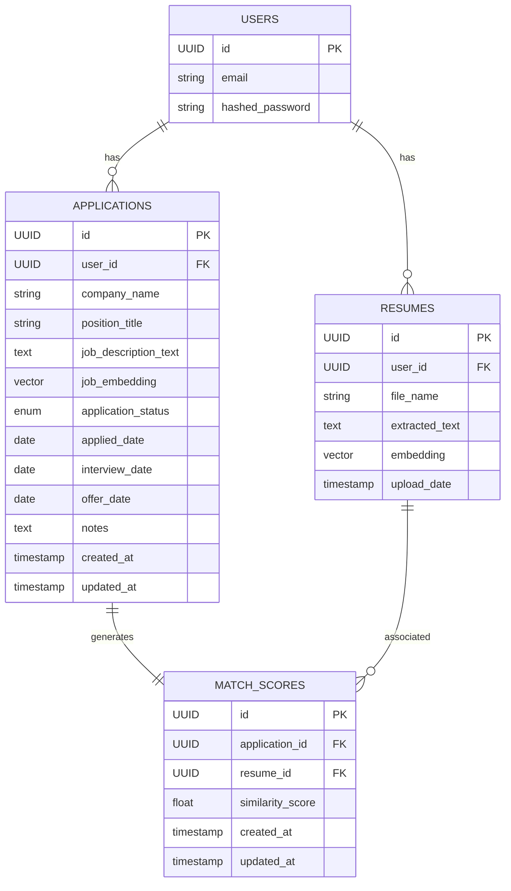

# 🗂️ Data Model

This document describes the core data model for the Job Tracker backend. It includes an Entity Relationship Diagram (ERD) and a summary of each main table/entity.

---

## Entity Relationship Diagram

---

## Table Summaries

### users

- **id**: UUID, primary key
- **email**: String, unique
- **hashed_password**: String

  **Relations**: One user has many resumes and many applications

### applications

- **id**: UUID, primary key
- **user_id**: UUID, foreign key to users
- **company_name**: String
- **position_title**: String
- **job_description_text**: Text
- **job_embedding**: Vector(1536)
- **application_status**: Enum (applied, interviewing, rejected, offer, accepted)
- **applied_date**: Date
- **interview_date**: Date (optional)
- **offer_date**: Date (optional)
- **notes**: Text
- **created_at**: Timestamp
- **updated_at**: Timestamp

  **Relations**: Many applications per user; one match_score per application

### resumes

- **id**: UUID, primary key
- **user_id**: UUID, foreign key to users
- **file_name**: String
- **upload_date**: Timestamp
- **extracted_text**: Text
- **embedding**: Vector(1536)

  **Relations**: Many resumes per user; one resume can have many match_scores

### match_scores

- **id**: UUID, primary key
- **application_id**: UUID, foreign key to applications
- **resume_id**: UUID, foreign key to resumes
- **similarity_score**: Float (0 - 1)

  **Relations**: One match score per application; many match_scores per resume

---

For more details, see the [README](../README.md) and other docs in this folder.
