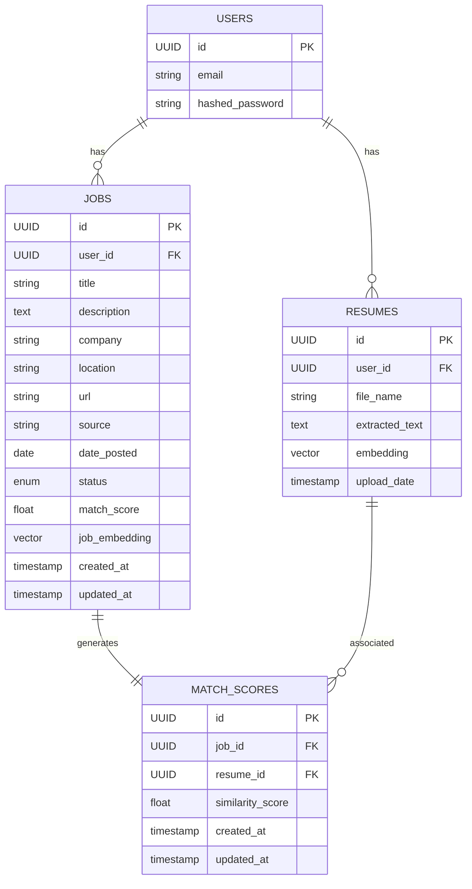

# 🗂️ Data Model

This document describes the core data model for the ResMatch backend. It includes an Entity Relationship Diagram (ERD) and a summary of each main table/entity.

---

## Entity Relationship Diagram

---

## Table Summaries

### users

- **id**: UUID, primary key
- **email**: String, unique
- **hashed_password**: String

  **Relations**: One user has many resumes and many jobs

### jobs

- **id**: UUID, primary key
- **user_id**: UUID, foreign key to users
- **title**: String, job title
- **description**: Text, job description (HTML allowed)
- **company**: String, company name
- **location**: String, job location (e.g., "Remote", "San Francisco")
- **url**: String, original job posting URL
- **source**: String, job board source (e.g., "RemoteOK", "Indeed")
- **date_posted**: Date, when job was originally posted
- **status**: Enum (new, saved, matched, applied, rejected)
- **match_score**: Float, similarity score with user's resume (0-1)
- **job_embedding**: Vector(1536), embedding of job description
- **created_at**: Timestamp
- **updated_at**: Timestamp

  **Relations**: Many jobs per user; one match_score per job

### resumes

- **id**: UUID, primary key
- **user_id**: UUID, foreign key to users
- **file_name**: String
- **upload_date**: Timestamp
- **extracted_text**: Text
- **embedding**: Vector(1536)

  **Relations**: Many resumes per user; one resume can have many match_scores

### match_scores

- **id**: UUID, primary key
- **job_id**: UUID, foreign key to jobs
- **resume_id**: UUID, foreign key to resumes
- **similarity_score**: Float (0 - 1)

  **Relations**: One match score per job; many match_scores per resume

---

For more details, see the [README](../README.md) and other docs in this folder.
