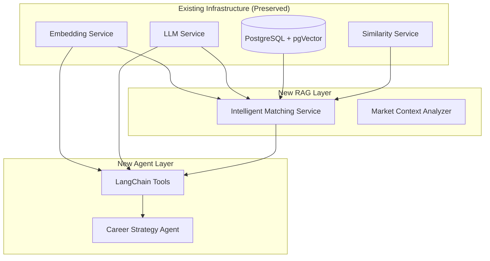

# RAG & Agent Features Implementation Plan

## Overview

This document outlines the implementation plan for two advanced AI features: **RAG-powered Intelligent Job Analysis** and **LangChain-based Career Strategy Agent**. Both features utilize a hybrid approach, extending existing infrastructure while introducing modern LLM application patterns.

## Architecture Design

### Hybrid Approach Strategy



### Design Principles

1. **Non-Destructive Enhancement**: Existing services remain unchanged
2. **Incremental Value**: Each feature can be implemented and tested independently
3. **Performance Preservation**: Leverage existing optimizations (caching, embedding storage)
4. **Maintainability**: Clear separation between legacy and new functionality

## Feature 1: RAG-Powered Intelligent Job Analysis

### Technical Specification

#### Core Functionality

- **Input**: Job ID + User context
- **Process**: Similar job retrieval → Market trend analysis → Strategic insights generation
- **Output**: Enhanced job analysis with market intelligence

#### Implementation Components

```python
# app/services/intelligent_matching_service.py
class IntelligentMatchingService:
    """
    RAG-powered job matching service.
    Extends existing pgVector search with market context analysis.
    """

    def __init__(self):
        # Reuse existing services - hybrid approach
        self.embedding_service = embedding_service
        self.llm_service = llm_service
        self.similarity_service = similarity_service

    def analyze_job_with_market_context(self, job_id: UUID, user_id: UUID) -> Dict[str, Any]:
        """
        Perform intelligent job analysis using RAG approach.

        Steps:
        1. Retrieve target job and user resume
        2. Find similar jobs using existing pgVector search
        3. Extract market trends using LLM analysis
        4. Generate strategic recommendations
        5. Provide competitive positioning insights
        """
```

#### Database Integration

Leverages existing pgVector infrastructure:

```sql
-- Existing vector search (no changes required)
SELECT
    id, title, company, description,
    1 - (job_embedding <=> :query_embedding) as similarity_score
FROM jobs
WHERE job_embedding IS NOT NULL
ORDER BY job_embedding <=> :query_embedding
LIMIT :limit;
```

#### API Endpoint

```python
# app/api/routes_intelligent_matching.py
@router.get("/jobs/{job_id}/intelligent-analysis")
def get_intelligent_job_analysis(
    job_id: UUID,
    include_market_context: bool = Query(True),
    context_depth: int = Query(5, ge=1, le=10),
    db: Session = Depends(get_db),
    current_user: User = Depends(get_current_user),
) -> IntelligentJobAnalysisResponse:
    """
    Enhanced job analysis with RAG-powered market intelligence.

    Returns:
    - Basic match score (existing functionality)
    - Market intelligence from similar jobs
    - Strategic recommendations
    - Competitive positioning analysis
    """
```

#### Response Schema

```python
# app/schemas/intelligent_matching.py
class MarketIntelligenceData(BaseModel):
    """Market intelligence extracted from similar jobs."""
    similar_jobs_analyzed: int
    average_similarity_score: float
    salary_range_insight: Optional[str]
    skill_trend_analysis: List[str]
    market_positioning: str

class IntelligentJobAnalysisResponse(BaseModel):
    """Enhanced job analysis response."""
    job_id: UUID
    basic_match_score: float  # Existing functionality preserved
    market_intelligence: MarketIntelligenceData
    strategic_recommendations: List[str]
    competitive_advantages: List[str]
    improvement_suggestions: List[str]
    analysis_timestamp: datetime
```

## Feature 2: LangChain-Based Career Strategy Agent

### Technical Specification

#### Core Functionality

- **Input**: Career goals + User context
- **Process**: Multi-step autonomous reasoning using LangChain agent
- **Output**: Comprehensive career strategy with actionable timeline

#### Agent Architecture

```python
# app/services/career_strategy_agent.py
class CareerStrategyAgent:
    """
    Multi-step career planning agent using LangChain.
    Orchestrates existing services as tools for autonomous planning.
    """

    def __init__(self):
        self.llm = ChatOpenAI(
            openai_api_key=settings.OPENAI_API_KEY,
            model_name="gpt-4o-mini",
            temperature=0.2  # Low temperature for consistent planning
        )

        self.tools = self._create_agent_tools()
        self.agent = initialize_agent(
            tools=self.tools,
            llm=self.llm,
            agent=AgentType.STRUCTURED_CHAT_ZERO_SHOT_REACT_DESCRIPTION,
            verbose=True,
            max_iterations=6
        )
```

#### Tool Integration

Wraps existing services as LangChain tools:

```python
# app/services/career_agent_tools.py
class CareerPlanningTools:
    """LangChain tools wrapping existing services."""

    def create_tool_list(self) -> List[Tool]:
        return [
            Tool(
                name="analyze_resume_skills",
                description="Extract and analyze skills from resume text",
                func=self._wrap_skill_extraction
            ),
            Tool(
                name="research_job_market",
                description="Research job market using RAG-powered analysis",
                func=self._wrap_market_research
            ),
            Tool(
                name="identify_skill_gaps",
                description="Identify gaps between current and target skills",
                func=self._wrap_gap_analysis
            ),
            Tool(
                name="create_learning_plan",
                description="Generate prioritized learning roadmap",
                func=self._wrap_learning_planning
            ),
            Tool(
                name="generate_job_strategy",
                description="Create job application and targeting strategy",
                func=self._wrap_job_strategy
            )
        ]

    def _wrap_skill_extraction(self, resume_text: str) -> str:
        """Tool wrapper for existing skill extraction service."""
        skills_data = skill_extraction_service.extract_skills_from_resume(
            resume_text, normalize=True
        )
        return self._format_for_agent(skills_data)
```

#### API Endpoint

```python
# app/api/routes_career_agent.py
@router.post("/career/strategic-planning")
def execute_career_strategy_planning(
    request: CareerStrategyRequest,
    db: Session = Depends(get_db),
    current_user: User = Depends(get_current_user),
) -> CareerStrategyResponse:
    """
    Multi-step career strategy planning using LangChain agent.

    Agent autonomously:
    1. Analyzes current skills and experience
    2. Researches target market conditions
    3. Identifies skill gaps and priorities
    4. Creates learning roadmap with timeline
    5. Generates job targeting strategy
    """
```

## Implementation Timeline

### Phase 1: RAG Infrastructure (Day 1)

#### Step 1.1: Dependencies Setup (30 min)

```bash
# Add to requirements.txt
langchain==0.1.20
langchain-openai==0.1.8
langchain-community==0.0.38
```

#### Step 1.2: Intelligent Matching Service (2.5 hours)

- **Task 1.2.1**: Core service implementation
- **Task 1.2.2**: Market data retrieval using existing pgVector
- **Task 1.2.3**: LLM-powered trend analysis
- **Task 1.2.4**: Strategic insights generation

#### Step 1.3: API Integration (1 hour)

- **Task 1.3.1**: Route handler implementation
- **Task 1.3.2**: Request/response validation
- **Task 1.3.3**: Error handling integration

#### Step 1.4: Schema Definition (30 min)

- **Task 1.4.1**: Response model creation
- **Task 1.4.2**: API documentation update

#### Step 1.5: Basic Testing (1 hour)

- **Task 1.5.1**: Unit tests for core functionality
- **Task 1.5.2**: Integration tests with existing services
- **Task 1.5.3**: API endpoint testing

### Phase 2: Agent Implementation (Day 2)

#### Step 2.1: Agent Architecture (30 min)

- **Task 2.1.1**: LangChain agent configuration
- **Task 2.1.2**: Tool integration strategy
- **Task 2.1.3**: Memory and callback setup

#### Step 2.2: Tool Implementation (2 hours)

- **Task 2.2.1**: Existing service wrappers
- **Task 2.2.2**: Tool input/output formatting
- **Task 2.2.3**: Error handling for tool execution

#### Step 2.3: Agent Service (1.5 hours)

- **Task 2.3.1**: Agent initialization and configuration
- **Task 2.3.2**: Multi-step reasoning implementation
- **Task 2.3.3**: Result structuring and formatting

#### Step 2.4: API Integration (1 hour)

- **Task 2.4.1**: Endpoint implementation
- **Task 2.4.2**: Request processing and validation
- **Task 2.4.3**: Response formatting

### Phase 3: Integration & Testing (Shared)

#### Step 3.1: System Integration (30 min)

- **Task 3.1.1**: Router registration in main.py
- **Task 3.1.2**: Dependencies verification
- **Task 3.1.3**: Configuration updates

#### Step 3.2: Comprehensive Testing (1 hour)

- **Task 3.2.1**: End-to-end workflow testing
- **Task 3.2.2**: Performance validation
- **Task 3.2.3**: Error scenario testing

#### Step 3.3: Documentation Update (30 min)

- **Task 3.3.1**: API documentation generation
- **Task 3.3.2**: Usage examples creation
- **Task 3.3.3**: Technical documentation update

## Technical Considerations

### Performance Optimization

1. **Caching Strategy**: Leverage existing LLM response caching
2. **Vector Search**: Utilize existing pgVector indexes
3. **Connection Pooling**: Reuse existing database connections
4. **Token Management**: Apply existing OpenAI usage optimizations

### Error Handling

```python
# Consistent error handling pattern
class IntelligentMatchingError(Exception):
    """Exception for intelligent matching operations."""
    pass

class CareerAgentError(Exception):
    """Exception for career agent operations."""
    pass

# Integration with existing error handling
try:
    result = intelligent_matching_service.analyze_job(...)
except IntelligentMatchingError as e:
    logger.error(f"Intelligent matching failed: {str(e)}")
    raise HTTPException(status_code=500, detail=str(e))
```

### Security Considerations

1. **Authentication**: Reuse existing JWT authentication
2. **Authorization**: Apply existing user-resource ownership checks
3. **Input Validation**: Use existing Pydantic model validation
4. **Rate Limiting**: Leverage existing OpenAI API management

### Monitoring & Logging

```python
# Enhanced logging for new features
logger.info(f"RAG analysis completed for job {job_id}: {analysis_summary}")
logger.info(f"Agent executed {step_count} steps for user {user_id}")

# Performance monitoring
@router.get("/jobs/{job_id}/intelligent-analysis")
def get_intelligent_analysis(...):
    start_time = time.time()
    try:
        result = service.analyze(...)
        duration = time.time() - start_time
        logger.info(f"RAG analysis completed in {duration:.2f}s")
        return result
    except Exception as e:
        logger.error(f"RAG analysis failed after {time.time() - start_time:.2f}s: {str(e)}")
        raise
```

## Testing Strategy

### Unit Testing

```python
# tests/test_intelligent_matching.py
class TestIntelligentMatchingService:
    """Test suite for RAG-powered job analysis."""

    def test_market_context_analysis(self):
        """Test market trend extraction from similar jobs."""
        pass

    def test_strategic_recommendations(self):
        """Test generation of actionable insights."""
        pass

# tests/test_career_agent.py
class TestCareerStrategyAgent:
    """Test suite for LangChain career planning agent."""

    def test_tool_execution(self):
        """Test individual tool functionality."""
        pass

    def test_multi_step_planning(self):
        """Test complete agent workflow."""
        pass
```

### Integration Testing

```python
# tests/test_rag_agent_integration.py
class TestRAGAgentIntegration:
    """Integration tests for RAG and Agent features."""

    def test_rag_agent_workflow(self):
        """Test combined RAG analysis → Agent planning workflow."""
        pass

    def test_existing_service_compatibility(self):
        """Ensure new features don't break existing functionality."""
        pass
```

## Deployment Considerations

### Environment Variables

```bash
# Additional configuration for new features
LANGCHAIN_VERBOSE=false
LANGCHAIN_CACHE_SIZE=100
AGENT_MAX_ITERATIONS=6
RAG_CONTEXT_DEPTH=5
```

### Docker Integration

No changes required to existing Docker configuration. New dependencies will be installed via updated requirements.txt.

### Database Migrations

No database schema changes required. Leverages existing pgVector infrastructure.

## Success Metrics

### Technical Metrics

1. **Response Time**: RAG analysis < 3s, Agent planning < 10s
2. **Accuracy**: Market trend analysis relevance > 80%
3. **Reliability**: Agent task completion rate > 95%
4. **Compatibility**: Zero regression in existing functionality

### Functional Metrics

1. **RAG Enhancement**: Demonstrable improvement in job analysis depth
2. **Agent Autonomy**: Successful multi-step planning without intervention
3. **Integration Quality**: Seamless interaction with existing services
4. **User Experience**: Consistent API behavior and error handling

## Future Enhancements

### Potential Extensions

1. **Advanced RAG**: Industry-specific knowledge bases
2. **Agent Sophistication**: Memory persistence across sessions
3. **Multi-Modal Analysis**: Resume image processing integration
4. **Real-Time Learning**: Agent behavior optimization from user feedback

### Scalability Considerations

1. **Microservice Separation**: Independent deployment of RAG/Agent features
2. **Async Processing**: Background job processing for complex analyses
3. **Caching Enhancement**: Distributed caching for agent results
4. **Load Balancing**: Separate scaling for compute-intensive operations

---

_This implementation plan provides a comprehensive roadmap for adding advanced RAG and Agent capabilities while preserving existing system stability and performance._
